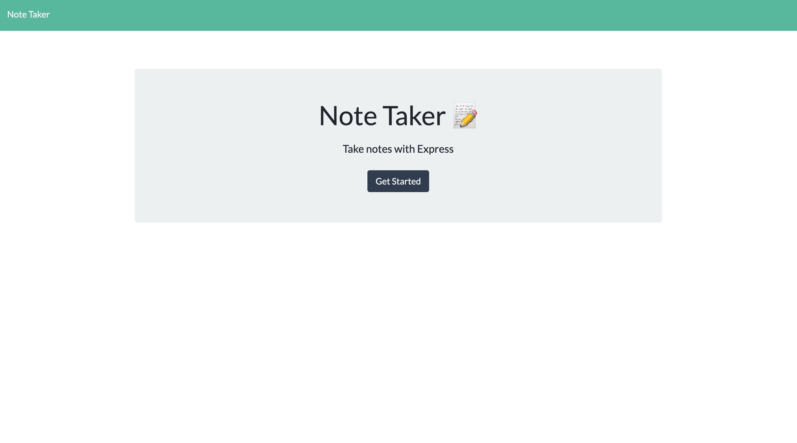
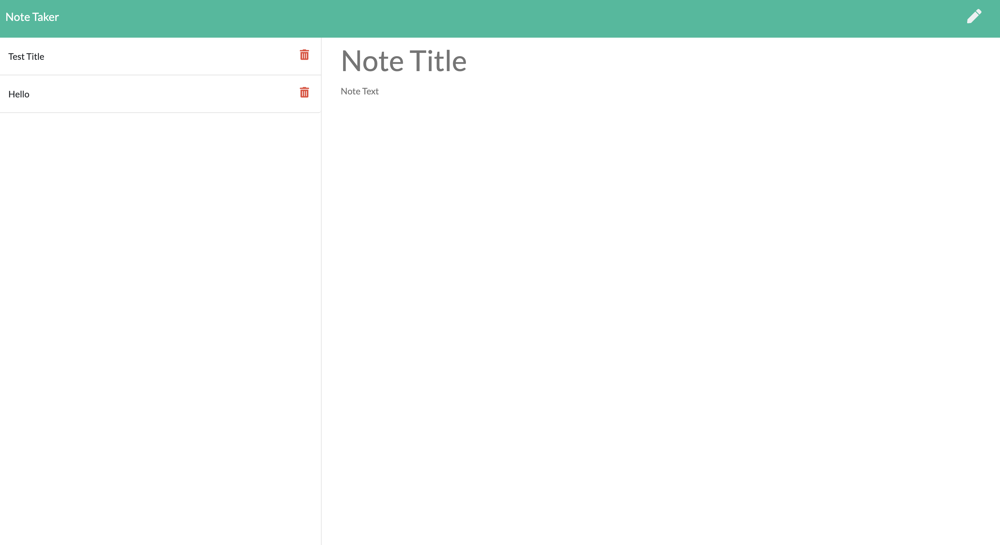

# Note Taker

## Description

This project lets the user create and save notes. The saved notes can also be deleted.

## Screen Shot

## Launch project on Heroku

https://salty-reaches-79590.herokuapp.com/

## Table of contents

- [Description](#description)
- [Installation](#installation)
- [Usage](#usage)
- [Contributing](#contributing)
- [Tests](#tests)
- [License](#license)
- [Questions](#questions)

## Installation

To install necessary dependencies, run the following command:

npm i

## Usage

node server.js

## License

This project is licensed under the MIT license.

## Questions

If you have any questions about the repo, open an issue or contact me directly at keonakirby@gmail.com. You can find more of my work at https://github.com/KeonaK
